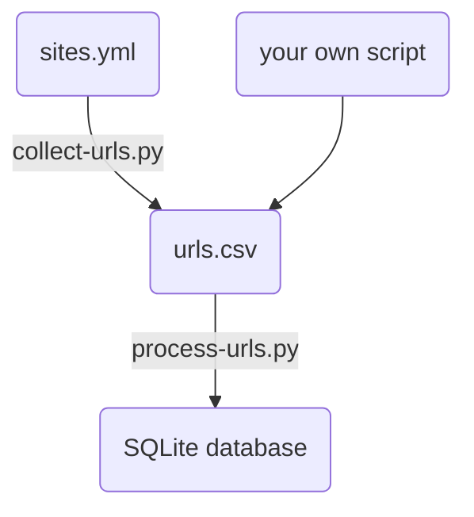

[](https://github.com/threat-defuser/extract-articles/actions)


# extract-articles

Code and scripts to extract data and populate the (example) database.


### High level overview




### Generating list of URLs

Description of the YAML file here ...

```console
$ python collect-urls.py --help

Usage: collect-urls.py [OPTIONS]

Options:
  --sites TEXT              The YML file describing the sites. This file is
                            only read.  [required]
  --out-file TEXT           The generated output CSV file.  [required]
  --pages-per-site INTEGER  Sample only so many pages per site for testing
                            purposes [default: collect all pages].
  --help                    Show this message and exit.
```

Example:
```console
$ python collect-urls.py --sites sites.yml --out-file urls.csv
```

Structure of the generated CSV file (example):
```csv
name,url,language
...,...,...
```


### Processing list of URLs

This step reads a CSV file with page site names, URLs, and languages and uses
this information to fetch the HTML, post-process it, and to save it to
database. Currently it both downloads the HTML and post-processes it. Later we
can separate this into two steps: fetching all HTML and post-processing all
HTML as a follow-up step.

```console
$ python process-urls.py --help

Usage: process-urls.py [OPTIONS]

Options:
  --csv-file TEXT  The input CSV file containing list of URLs to process.
                   [required]
  --db-file TEXT   The SQLite database file.  [required]
  --help           Show this message and exit.
```

Example:
```console
$ python process-urls.py --csv-file urls.csv --db-file articles.db
```
